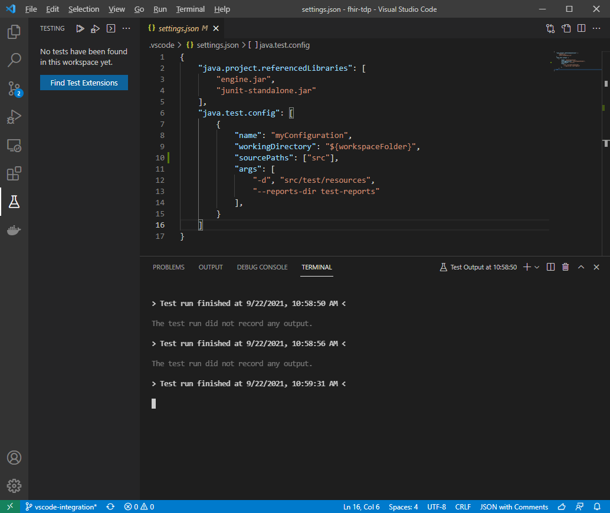

## Run with JUnit Console Launcher

Use the following command to run the tests using the test-engine and junit-platform-console-standalone.
This also exists as a vscode Task: **Run JUnit5 console standalone**.

```
java -jar junit-standalone.jar -cp engine.jar -d src\test\resources --reports-dir test-reports
```

[JUnit console launcher options doc.](https://junit.org/junit5/docs/current/user-guide/#running-tests-console-launcher-options)

Example of a run with JUnit summary report:


Using the vscode test-runner for file-based-tests (not Java classes) has so far been unsuccessful, this is the behavior:
