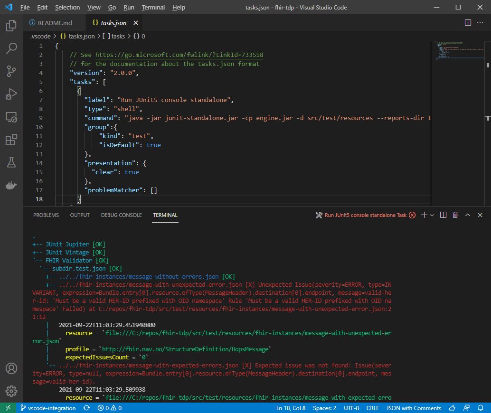

## Run with JUnit Console Launcher

[Options](https://junit.org/junit5/docs/current/user-guide/#running-tests-console-launcher-options)

```
java -jar junit-standalone.jar -cp engine.jar -d src\test\resources --reports-dir test-reports
```

Example of a run with JUnit summary report:
